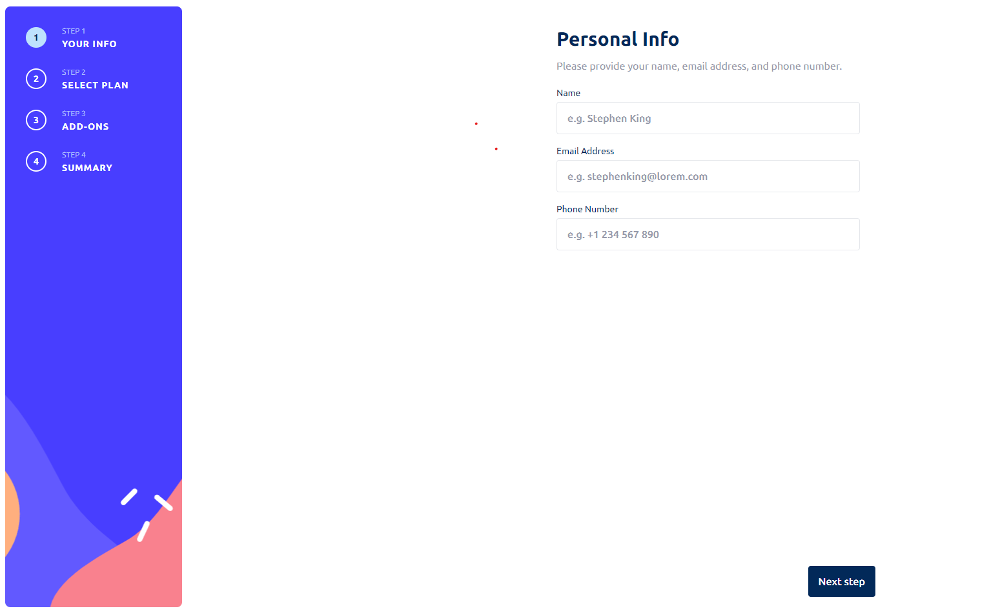

# Project Overview
Multi Step Form: Progressive Data Input with Seamless User Experience

"Multi Step Form" is a frontend application developed using Next.js 13 and TypeScript. Crafted for user-friendly input, it features a four-step form process: personal info, plan choosing, addons, and a summary. The segmented approach allows for intuitive navigation and efficient data input, providing a smooth user experience.

## Key Technologies & Concepts:
[Next.js](https://nextjs.org/)   
[TypeScript](https://www.typescriptlang.org/)    
[Tailwind CSS](https://tailwindcss.com/)    
[Radix](https://www.radix-ui.com/)   

## Project Purpose:
Alright, so what's the deal with "Multi Step Form"? Well, think of those super long, tedious forms you hate filling out. We took that pain away! This project breaks down a mammoth form into easy-peasy sections: personal stuff, choosing your plan, some optional goodies, and a quick recap. Developed with Next.js 13, it's a sweet example of making user experiences smoother. In short, we're making forms less yawn-worthy and more "heck, that was quick!"

## Main page


## Running the application locally
1\. **Clone the Repository**:
```
git clone https://github.com/eduardogomesf/multi-step-form.git
cd multi-step-form
```

2\. **Install dependencies**:
```
npm install
```

5\. **Start the application**:
```
npm run dev
```

5\. **Access the app**:
You can access the application on the url below
```
http://localhost:300
```
---
🛠️ Created by [eduardogomesf](https://github.com/eduardogomesf)
